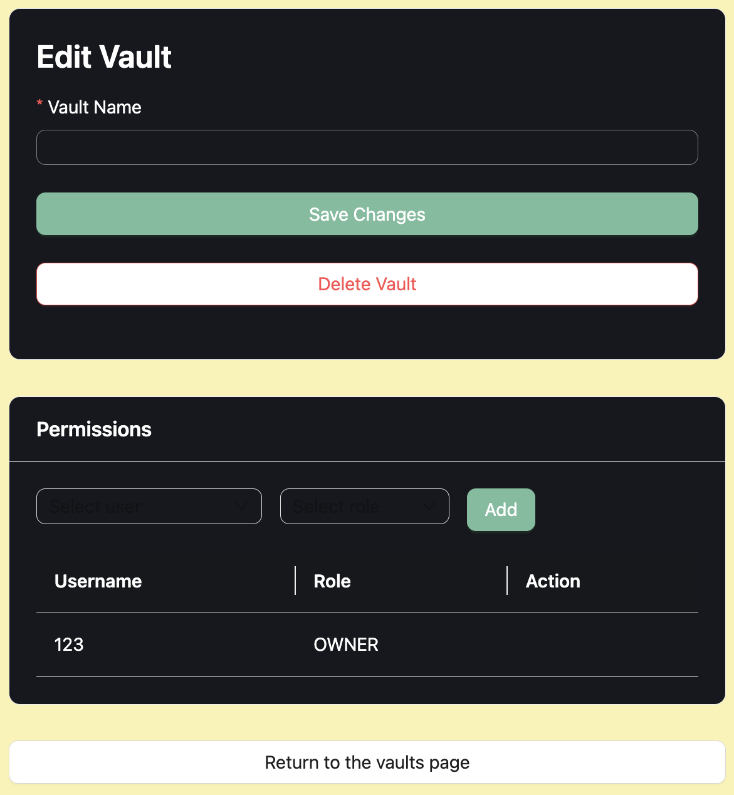
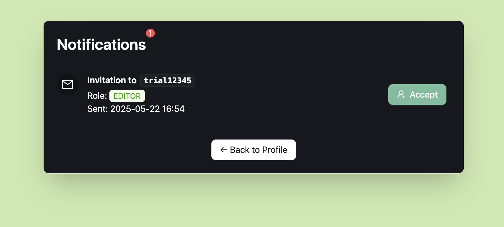
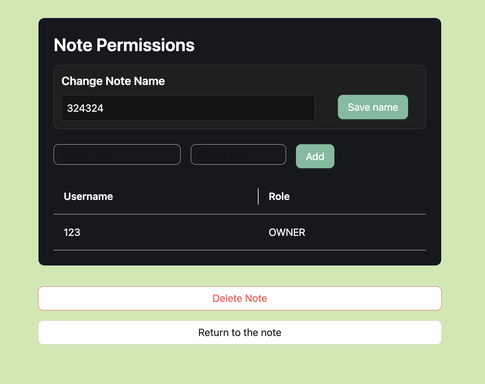

# Project: not moogle docs


## 🔴 **Project Overview**

The goal of this project is to combine the powerful note-taking and linking features of **Obsidian** with the collaborative capabilities of platforms like **Google Docs**. The system is designed to allow users to work together without relying on the paid Obsidian Sync service.

## 📂 **Features**
- Users can edit their notes simultaneously.
- Users can create **links between notes**, which are visualized through an **interactive knowledge graph**.
- **In-app notifications** allow users to invite friends directly to collaborate on notes and vaults.
- Each user is assigned a specific **role**:
  - **Owner**
  - **Editor**
- Users can only access notes where they are **participants** and can view or edit content based on their assigned role.
- The **role-based authorization** system simplifies access control and makes team collaboration more organized and secure.
- A **modular and user-friendly design** hides technical complexity behind a clean and intuitive interface.

## 👨🏾‍🔧 **Technologies Used:**

### **🚀 Frontend:**

| **Technology**        | **Purpose**   | **Source** | 
|--------------------| ---------- | ------------------ |
| Next.js 15 | A React framework that supports serverside rendering and a modern file-based routing system. | [NextJS](https://nextjs.org/docs)| 
| React 19 | A component-based JavaScript library for building fast and responsive user interfaces. | [React](https://react.dev) | 
| TypeScript 5 | A statically typed superset of JavaScript that improves code safety and developer experience. | [TypeScript](https://www.typescriptlang.org/docs) | 
| Ant Design v5 | A comprehensive UI library offering polished, ready-to-use components for professional interfaces. | [Ant Design](https://ant.design/components/overview/) | 
| Firebase | Our external API, enable users to chat simultaneously while they edit the editor page. | [Firebase](https://firebase.google.com/docs/reference/kotlin/com/google/firebase/firestore/Source) | 
| Tailwind CSS |Tailwind CSS is a utility-first CSS framework that helps developers build custom user interfaces quickly by applying pre-defined classes directly in the HTML. | [Tailwind CSS](https://tailwindcss.com) | 

## **👨🏼‍💻 Main Components:**

### **🚀 Frontend:**

| **Component**        | **Purpose**   | **Link** | 
|--------------------| ---------- | ------------------ |
| Vaults Page  | Displays the list of vaults owned by or shared with the user. | [Vaults](app/vaults/page.tsx)| 
| Notes Page | Allows users to view and manage notes under a specific vault. | [Notes](app/vaults/[vault_id]/notes/page.tsx) | 
| Markdown Editor (Yjs + WebSocket) | Enables real-time collaborative editing of a note. | [Editor](app/editor/Editor.tsx) | 
| Vault Settings Page | Used to manage vault permissions and update vault information. | [Vault Settings](app/vaults/[vault_id]/settings/page.tsx) | 
| Authentication Pages | Handle user authentication (login/register) | [Login](app/login/page.tsx) | 

## **👩🏻‍🚀 Launch & Deployment:**

### **🤖 Deployment:**

This project is automatically deployed onto vercel with every change pushed onto the main branch. Make sure to run ```npm run build``` before pushing changes to make sure vercel doesn't run into issues building the project.

### **👾 Development:**

1️⃣ **Install dependencies**
```
npm install
```
2️⃣ **Run the frontend locally**
```
npm run dev
```
3️⃣ **Run frontend tests**
```
npm test
```

## 🌊 **Illustrations and Flow of the App:**

### **1-) Landing → Auth:**

- User clicks Login / Register (Enters username + password)

### **2-) Vaults Dashboard:**

- User sees my vaults list.
- User sees shared vaults.
- User can create new vaults.

#### **2.1-) Vault → Notes:**
- Click the vault card (notes button) → routed to /vaults/[id]/notes
- (For further details of notifications page please check section 6)
#### **2.2-) Vault → Profile:**
- Click the profile button → routed to /profile/[id]
- (For further details of profile page please check section 3)

#### **2.3-) Vault → Vault_Settings:**
- Click the settings button → routed to / /vaults/[vault_id]/settings

**Functionality (Vault Settings Page)**: 
[screenshot]

### **3-) Profile Page:**

- Sees user_id, creation_date and status.

#### **3.1-) Profile → Dashboard:**
- User can see all registered users and their status.

#### **3.2-) Profile → Notifications:**
- User can see all vault invitations
- (For further details of notifications page please check section 5)

### **4-) Vault Settings Page:**

- User can change the vault name.
- User can send invitations to invite new users to work in same vault. (Permissions Card)

### **5-) Notifications Page:**

- User can see all invitations that have received.

### **6-) Notes page:**

- User can create new notes.

#### **6.1-) Notes → Note_Settings:**
- Click the notes card (settings button) → routed /vaults/[vault_id]/notes/[notes_id]/settings
- (For further details of notes settings page please check section X)

#### **6.2-) Notes → Editor:**
- Click the notes card (editor button) → routed /vaults/[vault_id]/notes/[notes_id]
- (For further details of editor page please check section X)

#### **6.3-) Notes → Profile:**
- (We already mentioned in section 3.)

### **7-) Notes Settings page:**

- User can change the note name.
- User can give a another user a role directly (without invitation, it's different than vault settings page)

### **8-) Editor page:**
- User will see the basic markdown editor panel when they enter the editor page.
- In the left sliding window (green square), other notes in that spesific vault can be seen.


#### **The commands in markdown editor:**


#### **Graph Linkage:**
* By using "[[note_name]]", you can link the notes between each other in graph linkage part.

#### **Chat:**
* Editor page also allow users to chat on the same screen

## 🤝 **Want to Contribute?**

- We welcome contributions from the community! If you'd like to add new features, fix bugs, or improve documentation, follow the steps below:

1. Fork the repository
2. Create a new feature branch (`git checkout -b feature/my-contribution`)
3. Commit your changes and push to your fork
4. Open a pull request describing your changes

### 📈 **Potential Improvements:**

#### **PDF Upload & Note Extraction:**
- Enable users to upload a PDF and automatically generate notes from its content (can be ideal for research papers), reports, or contracts.

#### **Role Change Notifications:**
- Instead of instantly updating roles on the notes settings page, show a user-friendly notification when someone’s permission level is changed.

#### **Version Control of History:**
- A potential improvement for the project is implementing version control of history, allowing users to track, revert, or compare changes made over time for better collaboration and error recovery.

## 🏆 **Authors and Acknowledgement:**

- This project was developed as part of the FS25 Software Engineering Lab at the University of Zurich.
- Special thanks to Timon Leupp for his continuous support and valuable guidance throughout the project.

### 👷‍♀️👷‍♂️ **Authors**:

| **Contributor**        | **ID**   | **Github Page** | 
|--------------------| ---------- | ------------------ |
| Klevis Nrecaj |22-725-832| [Klevis](https://github.com/Klevis27) | 
| Oliver Hostettler |22-717-003| [Oliver](https://github.com/AntWarz) |
| Sven Vestli |20-916-110| [Sven](https://github.com/SvenVest) |
| Elif Deniz İsbuga |24-745-911| [Elif](https://github.com/elifdenizi) |
| Necati Furkan Colak |24-746-323| [Necati](https://github.com/nfcolak) |